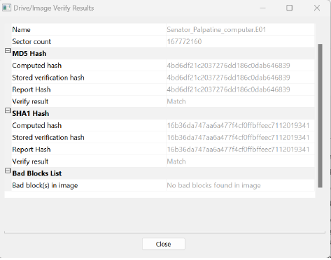
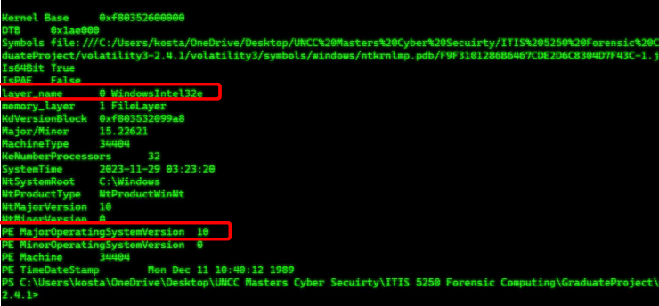
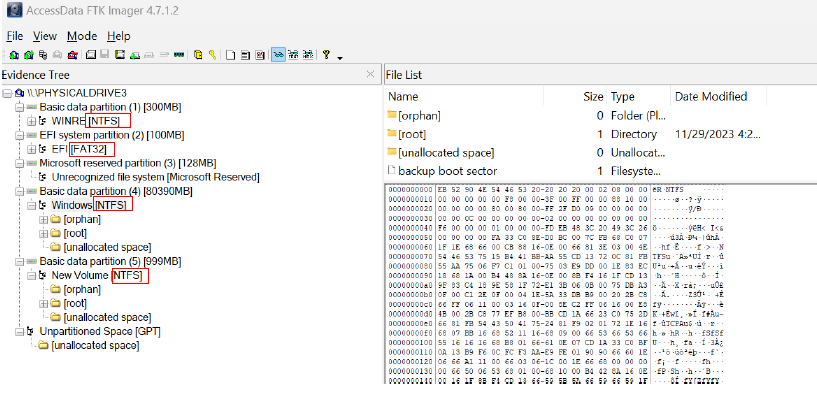
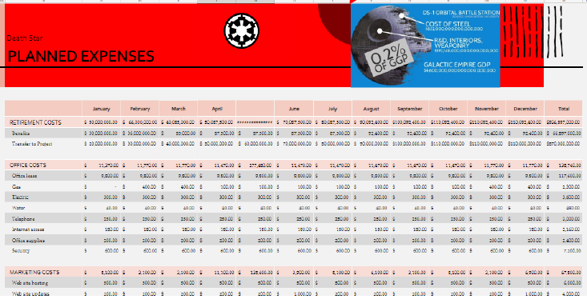
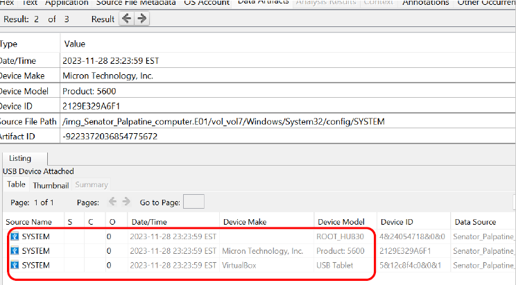
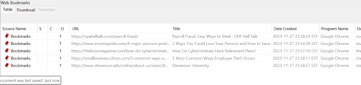

# Digital Forensics Investigation & Incident Reconstruction

## Overview

This project demonstrates the application of digital forensic methodologies to investigate a simulated financial fraud case. The objective was to acquire, preserve, analyze, and document digital evidence while maintaining forensic integrity and chain-of-custody principles.

The investigation focused on identifying evidence of fraud, recovering deleted artifacts, analyzing system activity, and reconstructing user actions through forensic examination of disk images and memory artifacts.

---

## Skills Demonstrated

* Digital Forensics
* Incident Investigation
* Evidence Acquisition
* Evidence Preservation
* Memory Analysis
* File System Analysis
* Browser Artifact Analysis
* USB Device Analysis
* Deleted File Recovery
* File Carving
* Timeline Reconstruction
* Hash Verification
* Forensic Reporting

---

## Tools Utilized

| Tool                  | Purpose                                              |
| --------------------- | ---------------------------------------------------- |
| FTK Imager            | Evidence acquisition and forensic image verification |
| Autopsy               | Artifact analysis and deleted file recovery          |
| Volatility 3          | Memory forensics and process analysis                |
| Arsenal Image Mounter | Mounting forensic disk images                        |
| HxD                   | Hex analysis and file carving                        |
| DB Browser for SQLite | Examination of browser and application databases     |
| Microsoft Excel       | Data analysis and reporting                          |
| DCode                 | Timestamp and metadata decoding                      |

---

## Investigation Objectives

The examination sought to:

* Verify forensic image integrity
* Identify operating system information
* Determine file system structures
* Recover deleted files
* Analyze browser activity
* Identify USB device usage
* Investigate hidden artifacts
* Reconstruct user activity
* Correlate evidence supporting fraudulent activity
* Produce a professional forensic report

---

## Key Findings

### Evidence Verification

Validated forensic evidence integrity using MD5 hash verification to ensure preservation of the original evidence.



---

### Memory Analysis

Utilized Volatility 3 to identify operating system information and analyze memory artifacts.



---

### File System Analysis

Examined NTFS and FAT32 file systems, partition structures, and disk allocation information.



---

### Deleted File Recovery

Recovered deleted artifacts through file carving and forensic recovery techniques using Autopsy and HxD.



---

### USB Device Analysis

Identified previously connected USB devices through forensic examination of system artifacts.



---

### Browser Artifact Analysis

Recovered browser bookmarks and user activity artifacts to support investigative findings.



---

## Methodology

### Phase 1 – Evidence Acquisition

1. Verify image integrity
2. Mount forensic image
3. Preserve original evidence
4. Document acquisition procedures

### Phase 2 – Examination

1. Analyze file systems
2. Recover deleted artifacts
3. Review browser activity
4. Examine USB history
5. Analyze memory artifacts

### Phase 3 – Analysis

1. Correlate evidence
2. Develop investigative timeline
3. Validate findings
4. Verify evidentiary integrity

### Phase 4 – Reporting

1. Document findings
2. Capture forensic evidence
3. Record methodology
4. Produce final forensic report

---

## Technologies & Concepts

* Digital Evidence Preservation
* Chain of Custody
* Memory Forensics
* Disk Forensics
* File Carving
* Hash Verification
* Incident Response
* Cyber Investigations
* Windows Forensics
* Artifact Analysis
* Security Investigations

---

## Repository Contents

```text
report/
└── ForensicReport.pdf

screenshots/
├── evidence-verification.png
├── memory-analysis-volatility.png
├── filesystem-analysis.png
├── deleted-file-recovery.png
├── usb-device-analysis.png
└── browser-artifact-analysis.png

README.md
```

---

## Academic Context

This project was completed as part of graduate cybersecurity coursework at the University of North Carolina at Charlotte. The investigation demonstrates practical application of forensic acquisition, artifact recovery, memory analysis, evidence preservation, and forensic reporting methodologies commonly used in Digital Forensics and Incident Response (DFIR) engagements.

---

## Author

**Kostace Kyser**

MS Cybersecurity
Cybersecurity GRC & Human-Risk Analyst
NIST CSF | HIPAA Compliance | Digital Forensics | Security Awareness

GitHub: https://github.com/kostacek
LinkedIn: https://linkedin.com/in/kostace-kyser-0172b7207
